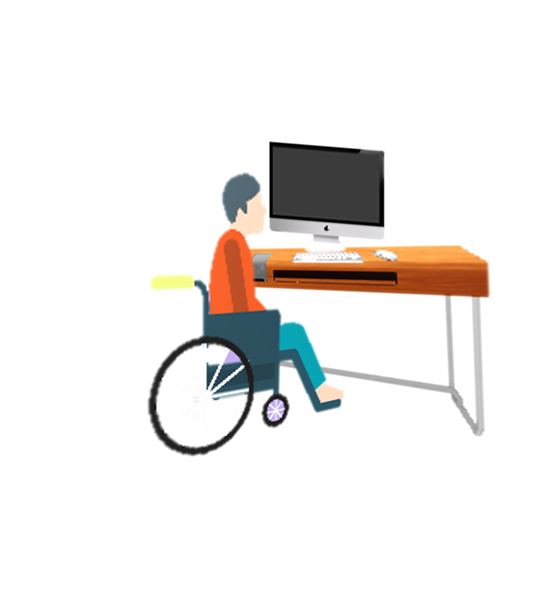
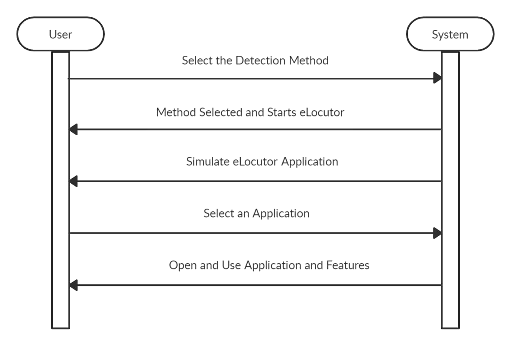
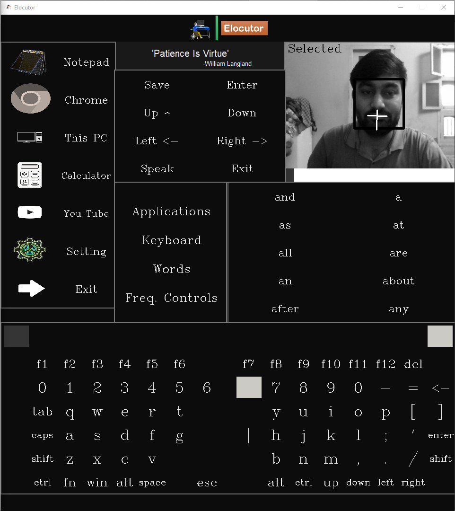

# Elocutor: An Assistant for Specially Abled 

Assistant for physically abled. The objective is to make people with different MND diseases accessible to their computers.

## Motivation 🔆
As we know there are many people who are physically not able to use a computer like Prof.
Stephen Hawking. It hinges their ability to communicate, work or to learn new technologies. This
solely fact motivates us as a computer student to make computer accessible to all. After
researching the topic we were able to get some direction from the former software developed, their
capabilities and flaws. We will try make an application accessible to all and make it user friendly.

## User Diagram 👩‍💻

## User Interface 🖥

## Project Modules 🏗
* Different Detection Modules :
    * Eye-Detection
    * Cheek-Detection
    * Eye-brow Detection
* User Movement Controlled Keyboard
* Detection Method Selection Menu
* Application Selection Menu
* Word Auto-Completion
* Next Word-Prediction
* Text-to-Speech
* Application Switching Module
* Frequently Used Options Menu

## Libraries 📚
Libraries:
* OpenCV
* Dlib
* Numpy
* Tkinter
* PyAutoGui
* Auto-Complete
* Pyttsx
* PIL

## References 📑
[01] Dlib Documentation: http://dlib.net/

[02] Dlib Workflow Diagram: https://dlib.org/

[03] Workflow Diagram of HOG: https://www.learnopencv.com/histogram-of-oriented-
gradients/

[04] Histogram and Gradients in HOG: https://www.learnopencv.com/histogram-of-oriented-
gradients/

[05] SVM Classifier: https://www.bogotobogo.com/python/scikit-
learn/scikit_machine_learning_Support_Vector_Machines_SVM.php

[06] Friends Dataset:
https://raw.githubusercontent.com/shilpibhattacharyya/Friends_Analysis/master/friends_dataset.
csv
[07] ACAT Developers Guide: https://01.org/acat/documentation
[08] OpenCV: https://opencv.org/
